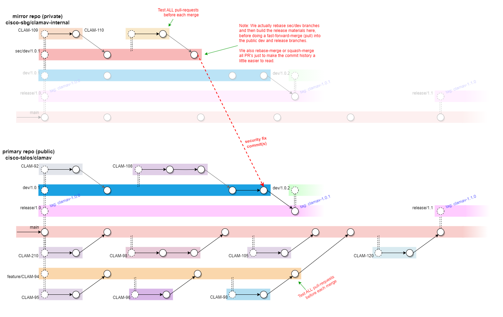

# ClamAV Git Work Flow

ClamAV's Git work flow isn't very complicated, but it is more structured than most. It looks like this. Note that in the diagrams below, merged branches are regular merges and will add all of the commits from the source branch to the destination branch. The diagram doesn't show all the merged commits, for simplicity:

#### `main`:

The development branch. testing is done in pull-requests (PR's), so this branch should be stable, though we make no guarantees.

#### `release/1.0`, `release/1.1`, etc.:

Feature release branches. These always contain the latest stable patch versions for each feature release.

When development towards the next feature release is complete, a new `release/X.Y` branch is created from `main` and a release tag is created.

When a new patch version is needed, a `dev/X.Y.Z` branch is created from the `release/X.Y` branch.  When development of that patch version is complete, the `dev/X.Y.Z` branch is merged back into the `release/X.Y` branch, and a release tag is created.

#### `dev/1.0.1`, `dev/1.0.2`, etc.:

A development branch used to test hotfixes prior to a patch release.

#### `sec/dev/1.0.1`, etc.:

A private development branch used to test security-related hotfixes prior to a patch release. This branch will be rebased like any feature branch as needed up until the release.

The ClamAV team maintains an internal mirror of the `clamav` repository in order to facilitate private branches, which are not a normal feature of the Git version control system.

On release day, the private `sec/dev/1.0.1` branch would be pulled into the public `dev/1.0.1` branch and then into the `release/1.0` branch where it would be tagged as "`clamav-1.0.1`".

#### `feature/description`:

A long-running branch for adding a major feature. It may be rebased several times with the default branch before it is ready to merge.

#### `CLAM-####-description`, `issue-####-description`:

A branch for working a JIRA task or GitHub issue. These are typically only found in a personal fork and appear as pull requests from the fork to the upstream `clamav` repository.
